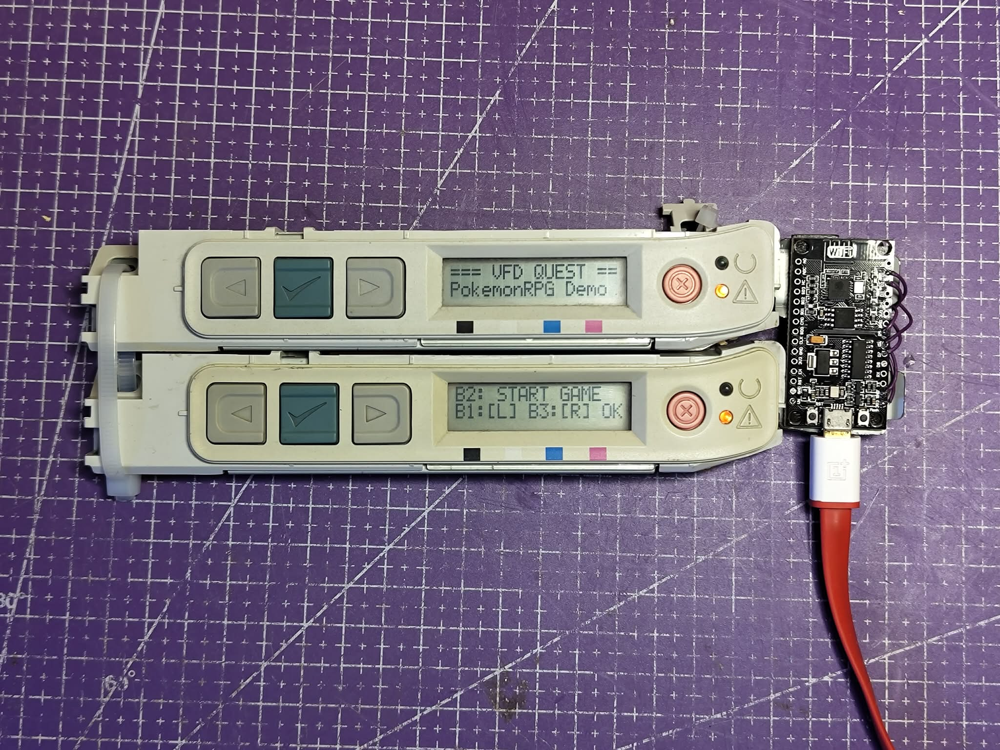
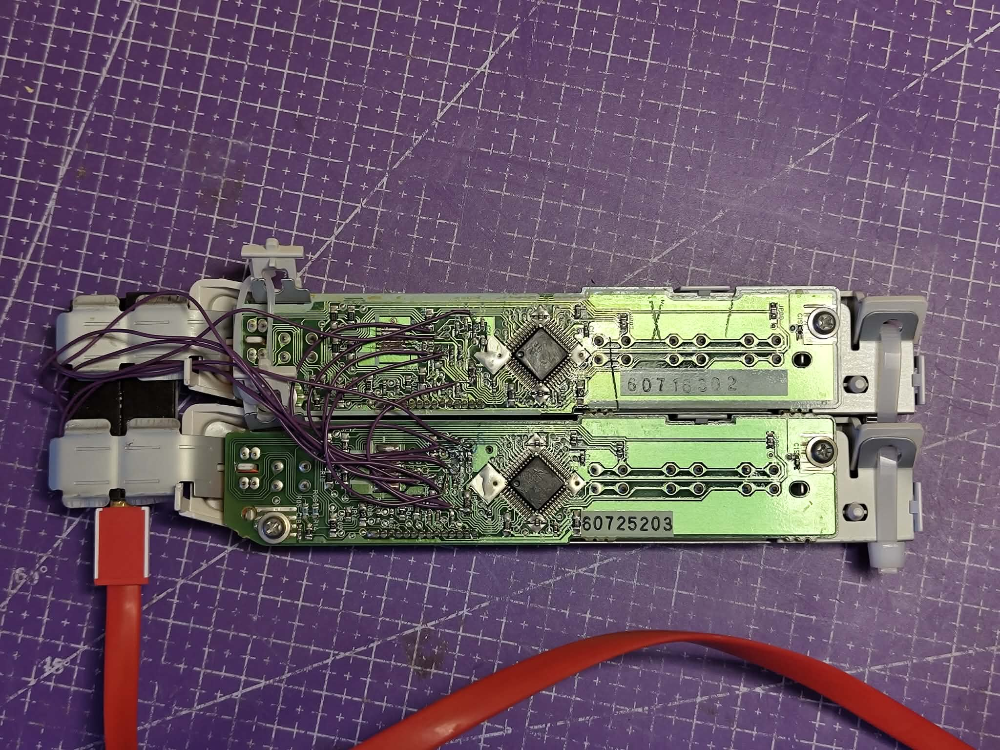

# HP LaserJet Front Panel Display Driver & RPG Demo (`hp-laserjet-screen-esp`)

An ESP8266 hardware driver and embedded game demo (*VFD Quest*) for dual front-panel display modules salvaged from HP Color LaserJet 1600/2600 series printers. Driven by dual **Rohm BU6740AK** display controllers over a shared SPI bus.

---

## 📷 Hardware Overview

| Front Panel (Dual Displays Running *VFD Quest*) | Rear Panel Wiring & PCB Interface |
| :---: | :---: |
|  |  |

---

## 🚀 Key Features

* **Dual Display Architecture**: Drives two stacked display panels simultaneously using hardware Chip Select (`CS1_PIN` / `CS2_PIN`) line multiplexing.
* **Full Controller Protocol Driver**: Low-level implementation of the 16-bit dual-nibble command and data framing required by the Rohm BU6740AK.
* **Front Panel Button Input Engine**: Integrated bidirectional SPI polling for reading physical pushbuttons with 40ms software debouncing.
* **Status LED Control**: Independent driving of status indicator LEDs per module.
* **Included RPG Demo (`game.cpp`)**: *VFD Quest*, a full turn-based retro RPG featuring state machine UI, battle mechanics, shop, inventory, and combat logs.

---

## 🔌 Pinout & Hardware Connections

### Display FPC (J701 Connector)
| Pin | Name | Type | Description |
| :---: | :--- | :---: | :--- |
| **1** | `MISO` | Output | Master In Slave Out (Button state feedback) |
| **2** | `3.3V` | Power | +3.3V DC Supply |
| **3** | `GND`  | Power | Common Ground |
| **4** | `MOSI` | Input  | Master Out Slave In (Command/Data framing) |
| **5** | `SCLK` | Input  | SPI Serial Clock |
| **6** | `/CS`  | Input  | Active-Low Chip Select |

### ESP8266 Interfacing Pin Map
| ESP8266 Pin | Function | Target Hardware |
| :--- | :--- | :--- |
| **`D1` (GPIO 5)** | Hardware `/CS1` | Top Display Module Chip Select (`CS1_PIN`) |
| **`D2` (GPIO 4)** | Hardware `/CS2` | Bottom Display Module Chip Select (`CS2_PIN`) |
| **`D5` (GPIO 14)**| Hardware `SCLK` | Shared SPI Serial Clock Line |
| **`D7` (GPIO 13)**| Hardware `MOSI` | Shared SPI MOSI Line |
| **`D6` (GPIO 12)**| Hardware `MISO` | Shared SPI MISO Line |

### Hardware Connection Wiring Diagram

```text
+------------------------------+                 +-------------------------------+
| Display Panel Connector J701 |                 |   ESP8266 (NodeMCU / Wemos)   |
+------------------------------+                 +-------------------------------+
|  Pin 1 (MISO)                | <-------------> |  Pin D6 (GPIO 12 - HMISO)     |
|  Pin 2 (3.3V)                | <-------------> |  3V3 (Power Rail)             |
|  Pin 3 (GND)                 | <-------------> |  GND (Ground)                 |
|  Pin 4 (MOSI)                | <-------------> |  Pin D7 (GPIO 13 - HMOSI)     |
|  Pin 5 (SCLK)                | <-------------> |  Pin D5 (GPIO 14 - HSCLK)     |
|  Pin 6 (/CS Top Display)     | <-------------> |  Pin D1 (GPIO 5  - CS1_PIN)   |
|  Pin 6 (/CS Bottom Display)  | <-------------> |  Pin D2 (GPIO 4  - CS2_PIN)   |
+------------------------------+                 +-------------------------------+
